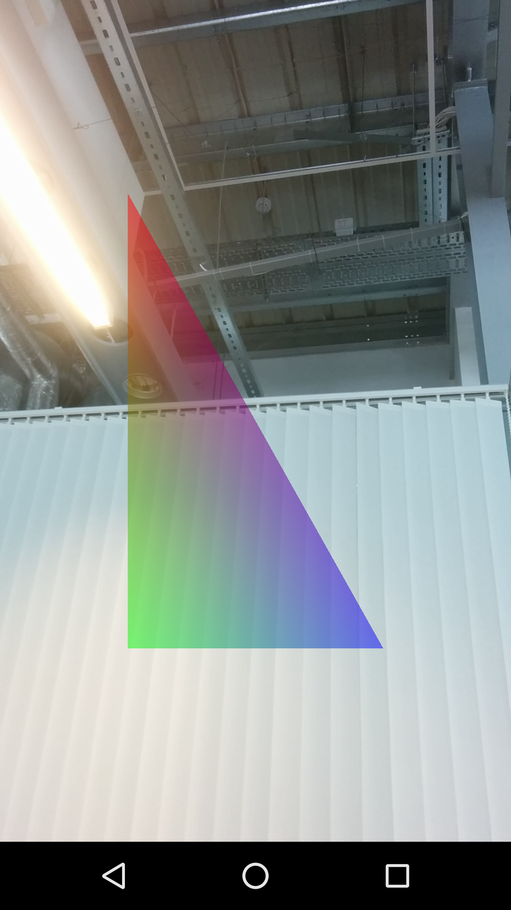

##Shader Camera
Forked from [LittleCheeseCake](https://github.com/yulu/ShaderCam)

###CameraRenderer
Drawing using OpenGL is implemented by rendering on GLSurfaceView. The common approach is subclass the GLSurfaceView and implements the GLSurfaceView.Renderer. The rendering tasks are performed by implementing the interface.

```java
public class CameraRenderer extends GLSurfaceView implements 
								GLSurfaceView.Renderer, 
								SurfaceTexture.OnFrameAvailableListener{
	@Override
	public synchronized void onSurfaceCreated(GL10 gl, EGLConfig config)
	{
		...
		//compile shader here
	}
	
	@Override
	public synchronized void onSurfaceChanged(GL10 gl, int width, int height) {
	   ...
	   //open camera and start preview here
	}
	
	@Override
	public synchronized void onDrawFrame(GL10 gl) {
	    ...
	    //draw frame as required
	}
	
}
```

###SurfaceTexture
SurfaceTexture Interface provided by Android SDK (API Level 11+) has made our life much easier when dealing with image streaming either from Camera or MediaPlayer. SurfaceTexture is bound with an OpenGL Texture id at its instantiate (mCameraTexture is discussed later, which generates OpenGL texture handle):

```java
@Override
public synchronized void onSurfaceChanged(GL10 gl, int width, int height) {
    ...
    SurfaceTexture mSurfaceTexture = new SurfaceTexture(mCameraTexture.getTextureId());
    ...
}

```
Listeners can be registered to SurfaceTexture.setOnFrameAvailable to make updates whenever a new frame is streamed in. Here the camera renderer is registered to listening for the updates, whenever a new frame is streamed in, the renderer is required to draw a new frame on the surface. Use mSurfaceTexture.updateTexImage() to query the most recent frame on the stream.

```java
@Override
public synchronized void onSurfaceChanged(GL10 gl, int width, int height) {
    ...
    mSurfaceTexture.setOnFrameAvailableListener(this);
    ...
}

...

@Override
public synchronized void onFrameAvailable(SurfaceTexture surfaceTexture)
{
    //request the renderer to draw frame when new frame available
	updateTexture = true;
	requestRender();
}

...

@Override
public synchronized void onDrawFrame(GL10 gl) {
    ...
	//render the texture to FBO if new frame is available, double check
	if(updateTexture){
		mSurfaceTexture.updateTexImage();
		...
	}
}
```
The texture updated by SurfaceTexture can only be bound to GL_TEXTURE_EXTERNAL_OES target rather than the GL_TEXTURE_2D target. Therefore a texture handle generated by the mCameraTexture object as mentioned above using the following implementation (bind with GLES11Ext.GL_TEXTURE_EXTERNAL_OES):

```java
public class OESTexture {
	...

	public void init(){
		int[] mTextureHandles = new int[1];
		GLES20.glGenTextures(1, mTextureHandles, 0);
		mTextureHandle = mTextureHandles[0];

		GLES20.glBindTexture(GLES11Ext.GL_TEXTURE_EXTERNAL_OES, mTextureHandles[0]);
		...

	}
}
```
In the fragment shader when the texture is binded, the first line has to be inserted:

```c
#extension GL_OES_EGL_image_external : require

precision mediump float;

uniform samplerExternalOES sTexture;

varying vec2 vTextureCoord;
varying vec4 vColor;

void main(){
    gl_FragColor = vec4(mix(vColor.rgb, texture2D(sTexture, vTextureCoord).rgb, vColor.a), 1.0);
}
```

###Draw a triangle

```java
private void renderTriangle(int aPosition, int aColor){
	GLES20.glEnableVertexAttribArray(aPosition);
	GLES20.glEnableVertexAttribArray(aColor);
	GLES20.glVertexAttribPointer(aPosition, VALUES_PER_TRIANGLE_VERTEX, GLES20.GL_FLOAT, false, 0, mTriangleVertexBuffer);
	GLES20.glVertexAttribPointer(aColor, VALUES_PER_COLOR, GLES20.GL_FLOAT, false, 0, mTriangleColorBuffer);
	GLES20.glDrawArrays(GLES20.GL_TRIANGLE_STRIP, 0, triangleVertexCount);
	GLES20.glDisableVertexAttribArray(aColor);
	GLES20.glDisableVertexAttribArray(aPosition);
}
```

###Draw Screen Quad
Using shaders, a simple screen quad can be easily drawn.

```java
private void init(){
	//Create full scene quad buffer
	final byte FULL_QUAD_COORDS[] = {-1, 1, -1, -1, 1, 1, 1, -1};
	mFullQuadVertices = ByteBuffer.allocateDirect(4 * 2);
	mFullQuadVertices.put(FULL_QUAD_COORDS).position(0);

	...
}

...
private void renderCameraTexture(int aPosition){
	GLES20.glBindTexture(GLES11Ext.GL_TEXTURE_EXTERNAL_OES, mCameraTexture.getTextureId());
	GLES20.glEnableVertexAttribArray(aPosition);
	GLES20.glVertexAttribPointer(aPosition, VALUES_PER_QUAD_VERTEX, GLES20.GL_BYTE, false, 0, mBackgroundQuadVertexBuffer);
	GLES20.glDrawArrays(GLES20.GL_TRIANGLE_STRIP, 0, quadVertexCount);
	GLES20.glDisableVertexAttribArray(aPosition);
}
```

Three issues are considered here 

1. A transformation matrix is queried using mSurfaceTexture.getTransformMatrix(float[]). This matrix transforms traditional 2D OpenGL ES texture coordinate column vectors of the form (s, t, 0, 1) where s and t are on the inclusive interval [0, 1] to the proper sampling location in the streamed texture. 

2. The orientation change of the phone has effect on the Surface dimension change (Height and Width swapped) but has no effect on the camera size (Width and Height remains as Width > Height all the time). This should be considered using an orientation matrix passed to the shader to adjust the orientation of the frame whenever the phone's orientation changes.

3. The screen dimension (SurfaceView dimension and the camera frame dimension might not be the same, to maintain a proper w/h ratio, a scaling factor should be passed to the shader to resize the screen quad.

The codes below are the passing of the three parameters to the shader. Noted that uTransformM updated every frame as required, uOrientationM updated whenever the orientation of the phone changes, and ratios updated also when the orientation of the phone changes since the w/h ratio changes when their actual values change. The later two are updated in the onSurfaceChanged(GL10, int width, int height) method. 

```java
@Override
public synchronized void onDrawFrame(GL10 gl) {
    ...
    int uTransformM = mOffscreenShader.getHandle("uTransformM");
	int uOrientationM = mOffscreenShader.getHandle("uOrientationM");
	int uRatioV = mOffscreenShader.getHandle("ratios");

	GLES20.glUniformMatrix4fv(uTransformM, 1, false, mTransformM, 0);
	GLES20.glUniformMatrix4fv(uOrientationM, 1, false, mOrientationM, 0);
	GLES20.glUniform2fv(uRatioV, 1, mRatio, 0);
	...
}
```

In the vertex shader, uTransformM, uOrientationM and ratios together do some work to make sure the frame texture coordinate fit into the phone window:

```c
attribute vec4 aPosition;
attribute vec4 aColor;

uniform mat4 uTransformM;
uniform mat4 uOrientationM;
uniform vec2 ratios;

varying vec2 vTextureCoord;
varying vec4 vColor;

void main(){
    vColor = aColor;
	gl_Position = aPosition;
	vTextureCoord = (uTransformM * ((uOrientationM * gl_Position + 1.0)*0.5)).xy;
	gl_Position.xy *= ratios;
}
```

###Closure
Some details are not covered in the post. It might be confusing by looking at the code fragments above. It will be much helpful to go through the complete implementation of the [demo app](https://github.com/yulu/ShaderCam) (which is quite concise, only a few hundered lines of codes). What will be more interesting? Try to replace the fragment shader with some funny shaders in [Instagram_Filter](https://github.com/yulu/Instagram_Filter) and [ShaderFilter](https://github.com/yulu/ShaderFilter), to see the interesting filter applied real-time on camera view.




